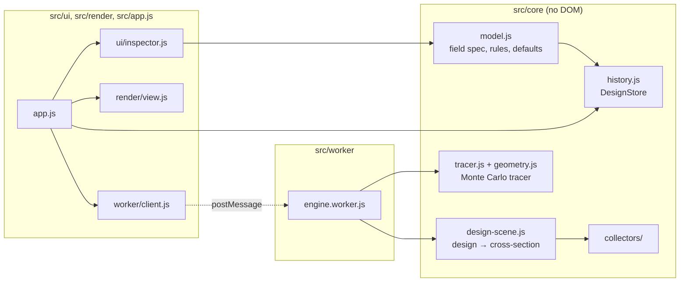

# Architecture

Linefocus follows the same plan as its sibling apps, KSlides and KDiagram. It uses plain ES modules with no runtime dependencies, keeps its core logic apart from the browser, stores one versioned document, and ships as a single offline HTML file.

## Layers

`src/core` never touches the DOM, so the tests run it directly in Node, and the worker and page share it unchanged.

## Sources of truth

The design document (`model.js`) holds only the engineer's intent: collector and receiver parameters, optics, sun, site, mounting, design point and simulation settings. The cross-section geometry, traces, figures, handles, selection, camera and panel state are all derived and never saved.

`DESIGN_SPEC` in `model.js` is written once in a small schema language (`spec.js`). That one definition drives three things: strict validation, the published JSON Schema (`schema.js`), and the inspector's labels, units, ranges and help text. Adding a field to the spec adds it everywhere, and a test fails until the committed schema is regenerated.

## Edit pipeline

1. A gesture calls `store.begin(label)`. Typed values and button presses use `store.transact`.
2. During a drag, each move mutates `store.design` and calls `store.preview()`. The app rebuilds the cross-section on the main thread, which is cheap, so geometry follows the pointer, and it asks the worker for a quick preview trace.
3. `store.commit()` validates the whole design, including the cross-field rules. On failure it restores the snapshot and emits `rollback`. The inspector keeps the refused value and its message on screen so it can be corrected.
4. A successful commit records leaf patches as one undo command, emits `commit`, and the app autosaves (debounced) and traces again: first a preview, then the full ray count.

Escape, a lost pointer or a window blur cancels a drag.

## Tracing off the main thread

`EngineClient` sends jobs to `engine.worker.js` on named channels. The worker traces in chunks of 32,768 rays and yields between chunks. If a newer job has arrived on the same channel, it abandons the old one, so a fast drag never queues stale work. Each block of 4,096 rays has its own seed, so a trace split into chunks equals one uninterrupted trace exactly (a test checks this). Results carry the cross-section they were traced from, so the view never mixes geometry and rays from different designs.

## Rendering

`render/view.js` draws to one Canvas 2D surface in world units of metres, +y up:

- a grid that rescales with zoom;
- the traced ray paths, blended additively and coloured by where each ray ended;
- surfaces, with a mirror's opaque back drawn as a darker line behind its reflecting face;
- a flux ring around the absorber, scaled and coloured by local flux;
- the sun on its arc, and the drag handles.

Draw requests are coalesced into one animation frame. Handles come from `core/handles.js`, which also maps a dragged point back to a design value, so the mapping can be tested without a browser.

## Commands and shell

Every action is a `Command` in `app.js`: label, icon, shortcut, enabled and pressed state, and a run function. Ribbon buttons, titlebar buttons and the Ctrl+K palette all refer to commands by id. One delegated click listener on the document routes any `[data-cmd]` element to its command, so buttons that are rebuilt (each ribbon tab switch rebuilds the ribbon) never lose their handler. The browser test clicks every enabled ribbon button to make sure each one reaches its command.

## Persistence and security

The current design autosaves to IndexedDB (database `linefocus`, falling back to localStorage key `linefocus-design`). Opening a file or starting a new design replaces it after a confirmation that offers a download first. Every load goes through `parseDesign`, which rejects foreign formats, newer versions, unknown keys and prototype keys. The dev server (`serve.mjs`) allows only GET and HEAD, stays inside the project folder, binds to 127.0.0.1 and sends a Content Security Policy. For the single-file build it allows the inline script by hash.

## Build

`build.mjs` wraps each module in a small `require` registry and runs the worker from a Blob URL. It inlines the stylesheet, the Archivo font and the favicon. It supports only the module syntax the source uses, and the build fails loudly on anything else. `build-pages.mjs` assembles `_site/`. It computes the marketing page's figures with the real engine: the hero trace, the energy ledger and the agreement with Ray Optics.
