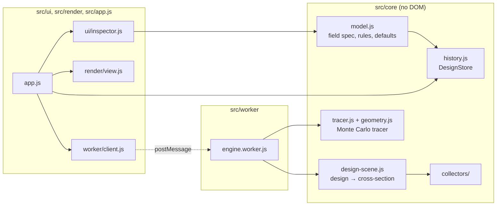

# Architecture

Linefocus follows the same plan as its sibling apps, KSlides and KDiagram. It uses plain ES modules with no runtime dependencies, keeps its core logic apart from the browser, stores one versioned document, and ships as a single offline HTML file.

## Layers

`src/core` never touches the DOM, so the tests run it directly in Node, and the worker and page share it unchanged.

## Sources of truth

The design document (`model.js`) holds only the engineer's intent: collector and receiver parameters, optics, sun, site, mounting, design point and simulation settings. The cross-section geometry, traces, figures, handles, selection, camera and panel state are all derived and never saved.

`DESIGN_SPEC` in `model.js` is written once in a small schema language (`spec.js`). That one definition drives three things: strict validation, the published JSON Schema (`schema.js`), and the inspector's labels, units, ranges and help text. Adding a field to the spec adds it everywhere, and a test fails until the committed schema is regenerated.

## Edit pipeline

1. A gesture calls `store.begin(label)`. Typed values and button presses use `store.transact`.
2. During a drag, each move mutates `store.design` and calls `store.preview()`. The app rebuilds the cross-section on the main thread, which is cheap, so geometry follows the pointer, and it asks the worker for a quick preview trace.
3. `store.commit()` validates the whole design, including the cross-field rules. On failure it restores the snapshot and emits `rollback`. The inspector keeps the refused value and its message on screen so it can be corrected.
4. A successful commit records leaf patches as one undo command, emits `commit`, and the app autosaves (debounced) and traces again: first a preview, then the full ray count.

Escape, a lost pointer or a window blur cancels a drag.

## Tracing off the main thread

`EngineClient` sends jobs to `engine.worker.js` on named channels:

| Channel | Job | Result |
|---|---|---|
| `design-point` | Trace the design point, as a quick preview and then at full ray count | Scene, figures, trace |
| `acceptance` | Sweep misalignment both ways | Transmission curve, half-angles, C·sin θ90 |
| `annual` | Trace the incidence-angle grid, then integrate four days and a year | Grid, days, year |
| `optimise` | Nelder–Mead search, then confirmation | Best values, history, confirmed gain and noise |

A newer job on a channel supersedes the older one. The worker traces in chunks (32,768 rays for the design point, one study point or one candidate for the rest) and yields between them. If a newer job has arrived on the same channel, it abandons the old one, so a fast drag never queues stale work. A `cancel` message marks a channel with a fresh id and starts nothing, so the Stop button reuses the same mechanism. Each block of 4,096 rays has its own seed, so a trace split into chunks equals one uninterrupted trace exactly (a test checks this). Results carry the cross-section they were traced from, so the view never mixes geometry and rays from different designs.

The app runs the acceptance and annual studies automatically, one after the other, once a full design-point trace has settled for the current revision. While they run, the Studies panel marks older results as updating rather than hiding them.

## Geometry that depends on the sun

LFR rows turn with the sun, so `buildDesignScene(design, aimDeg)` takes the sun's transversal angle. Other collectors ignore it. The canvas and the design point use the design point's angle. The incidence grid rebuilds the field for each θT, the acceptance sweep keeps the rows aimed at the design point while the sun moves, and the optimiser's annual objective rebuilds the field for each sun position. `tracksSun(design)` and `tracksTransversally(design)` are the two questions the rest of the code asks; no other code checks the collector type to decide how to aim.

## Studies pipeline

`studies.js` turns traces into engineering figures in three steps. The incidence grid traces η at fixed sun angles. Bilinear interpolation then gives η at any angle. Day and year integrate `DNI · W_ref · (cos θi when the reference has a cosine) · η · η_end` over sun positions from `solar.js`. End losses are an analytic factor outside the trace. DNI comes from the ASHRAE clear-sky model or from the 8,760 values of an imported EPW file stored in the design.

## Optimiser

`optimise.js` maps chosen design values to a unit box and runs Nelder–Mead. Every candidate goes through `validateDesign`; a `ValidationError` scores minus infinity. Candidates share one seed. Annual objectives trace at most 36 sun positions, clustered once per run from the year's hours. The result is confirmed at two fresh seed pairs for a noise estimate, and annual objectives are also confirmed with the full Year study, so the number shown is the number the Studies panel will show after Apply. Optimiser settings are session state per collector type and are never saved in the design.

## Known costs

- The undo snapshot, every preview and every worker message copy the whole design with `structuredClone`. A design with an EPW file carries 8,760 numbers, about 70 KB. That is fine today, but it is the first thing to slim (for example, by storing the weather by reference) if designs grow.
- The annual study takes about 0.2 s for a trough and 4–7 s for an LFR or CPC, whose grids have two axes. An optimiser run with annual objectives takes 15–60 s, mostly in the candidates and the final Year-study confirmation.

## Rendering

`render/view.js` draws to one Canvas 2D surface in world units of metres, +y up:

- a grid that rescales with zoom;
- the traced ray paths, blended additively and coloured by where each ray ended;
- surfaces, with a mirror's opaque back drawn as a darker line behind its reflecting face;
- a flux ring around the absorber, scaled and coloured by local flux;
- the sun on its arc, and the drag handles.

Draw requests are coalesced into one animation frame. Handles come from `core/handles.js`, which also maps a dragged point back to a design value, so the mapping can be tested without a browser.

## Commands and shell

Every action is a `Command` in `app.js`: label, icon, shortcut, enabled and pressed state, and a run function. Ribbon buttons, titlebar buttons and the Ctrl+K palette all refer to commands by id. One delegated click listener on the document routes any `[data-cmd]` element to its command, so buttons that are rebuilt (each ribbon tab switch rebuilds the ribbon) never lose their handler. The browser test clicks every enabled ribbon button to make sure each one reaches its command.

## Persistence and security

The current design autosaves to IndexedDB (database `linefocus`, falling back to localStorage key `linefocus-design`). Opening a file or starting a new design replaces it after a confirmation that offers a download first. Every load goes through `parseDesign`, which rejects foreign formats, newer versions, unknown keys and prototype keys. The dev server (`serve.mjs`) allows only GET and HEAD, stays inside the project folder, binds to 127.0.0.1 and sends a Content Security Policy. For the single-file build it allows the inline script by hash.

## Build

`build.mjs` wraps each module in a small `require` registry and runs the worker from a Blob URL. It inlines the stylesheet, the Archivo font and the favicon. It supports only the module syntax the source uses, and the build fails loudly on anything else. `build-pages.mjs` assembles `_site/`. It computes the marketing page's figures with the real engine: the hero trace, the energy ledger and the agreement with Ray Optics.
